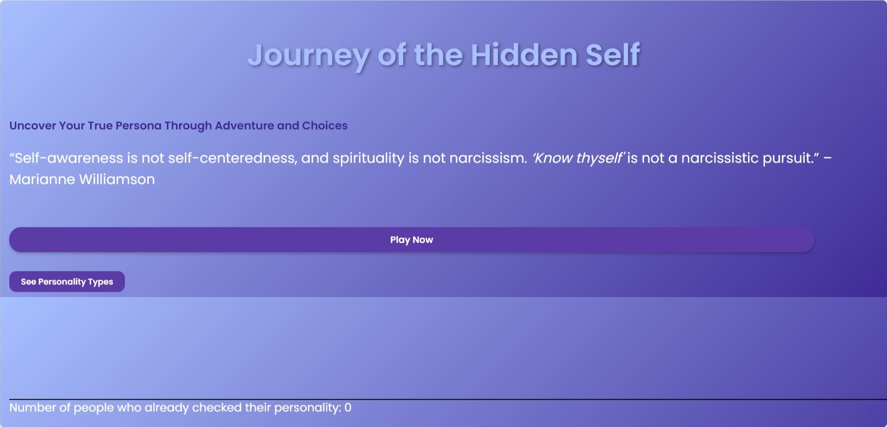
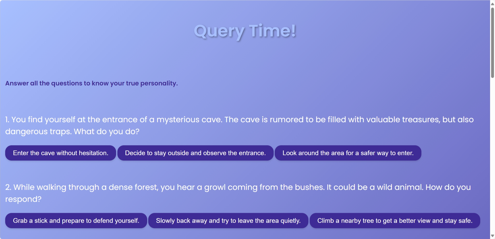
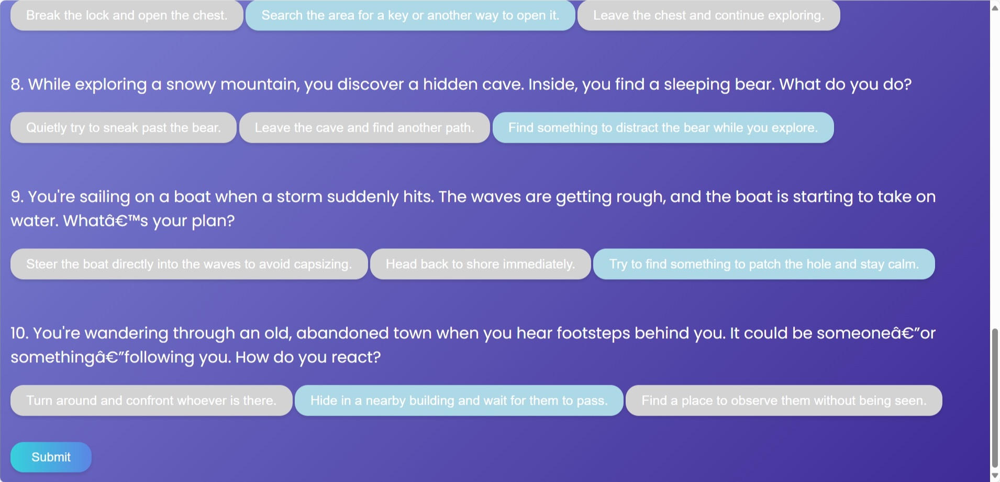
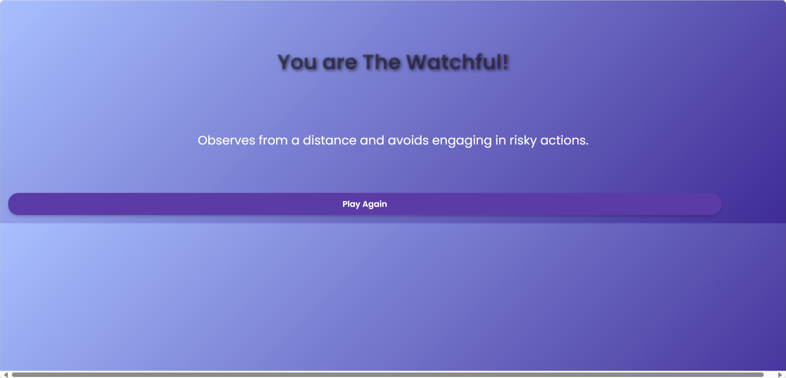
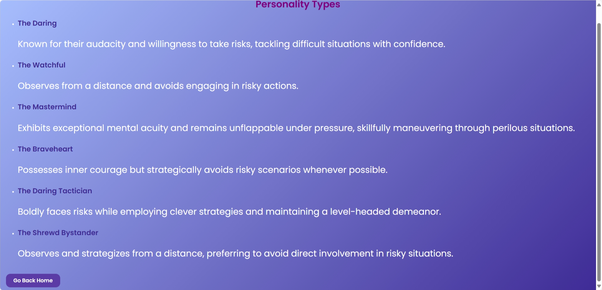

# cs50x Final Project: Journey of the Hidden Self
### Video Demo: [Youtube Video](https://youtu.be/bOxEPQBpq9o)
### Description:
This Flask-based web application is designed to show the user their personality so that they can know more about themselves. It's like a text based game where the user gets into 10 different scenarios and select from 3 different options. The options are designed to test user's decision making and know about their personality. The user gets a result based on all the questions answered. This part is logically handled using python.

### Used Properties:
HTML, CSS, python(Flask), sqlite3, JSON files, and JavaScript were used to implement this web application.

### File List:
- project(main folder)
  - static(sub-folder)
    - options.js
    - personalities.json
    - story.json
    - style.css
  - templates(sub-folder)
    - index.html
    - layout.html
    - result.html
    - story.html
    - types.html
  - app.py
  - counter.db
  - README.md
  - requirements.txt

### Features:
*layout.html* is the layout file of my every HTML file. I've included meta tags for viewing my web application in mobile phones smoothly too. In the home page the user will see a *play now* button and also a see personality types button. HTML tag, a, was used to link these two buttons to other pages. This two are actually not buttons but anchor tags. CSS code was used to style them as buttons in style.css file. At the bottom of the page user will see how many people have already checked their personality already. *counter.db* database file was used to keep track of that. Everytime used presses the *submit* button in the query page, the database's counter column gets incremented by one. If user presses *See Personality Types* button, it'll take them to the Types page where they can see all personality the types with their description. HTML tags were used to loop through a list of dictionaries. In *app.py* the JSON file, personalities.json, was loaded as a list of dictionaries and passed into the *types.html* file. There is a button at the bottom of the types page which lets the user go back to the home page. If user presses the *Play Now* button in the home page, they'll go to the story route where they're given 10 different options. A JSON file, *story.json*, was used to store the questions and options. They are loaded in *app.py* and passed to the html file, *story.html*, in the same manner. JavaScript was used to not let the user choose more than one option. The options gets locked once user clicks one of them. Hidden class was used to store all the values of the options in an array as user clicked them one by one and the array was sent to the submit route. JavaScript and CSS was combindly used to make the submit button appear only after user has answered all the questions. After getting the array containing the values of user's answers(a,b,c), in the result route, if statements were used to determine which options were clicked the most or if there was a tie. Based on the result of the most clicked option or a tie between two options, user is shown a personality type from 6 different types. The answers are logically handled so that user gets their correct personality. The *requirements.txt* file contains the dependencies I used in my project.

### Challenges:
1. The toughtest challenge was to style my website using CSS. A lot of time was spend to search different CSS styles and properties to make the web application look cool and modern.
2. Implementing the effect of only choosing one option from three and also make the submit form appear when all the questions are answered was quite difficult. It required a bit of research on JavaScript as well as a lot of testing and debugging.
3. Using key frames to animate the result was also a bit challenging but this part was fun.

### Screenshots:

#### Homepage

#### Query Pages

#### Result Page

#### Personality Types Page
